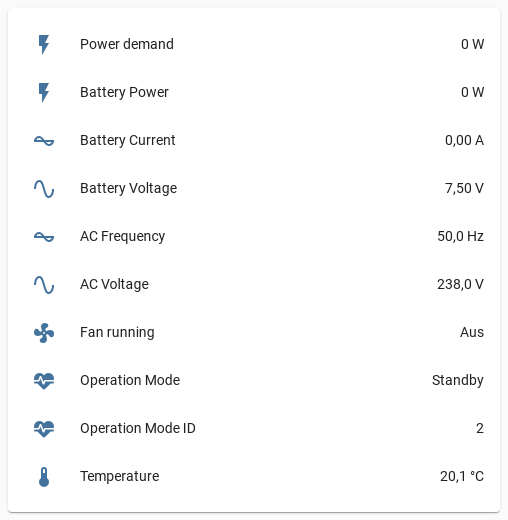

# esphome-soyosource-gtn-virtual-meter


[](https://www.buymeacoffee.com/syssi)

ESPHome component to simulate the current clamp to control the Soyosource GTN1200 limiter




## Supported devices

* GTN-1000LIM24, GTN-1000LIM36, GTN-1000LIM48, GTN-1000LIM72, GTN-1000LIM96
* GTN-1200LIM48, GTN-1200LIM72, GTN-1200LIM96

It looks like there is no GTW (waterproof) version of the device with limiter / RS485 support.

## Requirements

* [ESPHome 1.18.0 or higher](https://github.com/esphome/esphome/releases).
* RS485-to-TTL module (`HW-0519` f.e.)
* Generic ESP32 or ESP8266 board
* Required 
  * `Battery CP Grid` **N**
  * `Bat CP Mode Power` **Upper power limit**
  * `Bat AutoLimit Grid` **Y**

## Schematics

```
               RS485                      UART
┌─────────┐              ┌──────────┐                ┌─────────┐
│         │              │          │<----- RX ----->│         │
│         │<-----B- ---->│  RS485   │<----- TX ----->│ ESP32/  │
│ GTN1200 │<---- A+ ---->│  to TTL  │<----- GND ---->│ ESP8266 │
│         │<--- GND ---->│  module  │<-- 3.3 VCC --->│         │<-- VCC
│         │              │          │                │         │<-- GND
└─────────┘              └──────────┘                └─────────┘

```

Please make sure to power the RS485 module with 3.3V because it affects the TTL (transistor-transistor logic) voltage between RS485 module and ESP.

## Installation

You can install this component with [ESPHome external components feature](https://esphome.io/components/external_components.html) like this:
```yaml
external_components:
  - source: github://syssi/esphome-soyosource-gtn-virtual-meter@main
```

or just use the `esp32-example.yaml` / `esp8266-example.yaml` as proof of concept:

```bash
# Install esphome
pip3 install esphome

# Clone this external component
git clone https://github.com/syssi/esphome-soyosource-gtn-virtual-meter.git
cd esphome-soyosource-gtn-virtual-meter

# Create a secrets.yaml containing some setup specific secrets
cat > secrets.yaml <<EOF
wifi_ssid: MY_WIFI_SSID
wifi_password: MY_WIFI_PASSWORD

mqtt_host: MY_MQTT_HOST
mqtt_username: MY_MQTT_USERNAME
mqtt_password: MY_MQTT_PASSWORD
EOF

# Validate the configuration, create a binary, upload it, and start logs
# If you use a esp8266 run the esp8266-examle.yaml
esphome run esp32-example.yaml

```

## Configuration

```yaml
substitutions:
  name: soyosource-gtn-virtual-meter

esphome:
  name: ${name}
  platform: ESP32
  board: esp-wrover-kit

external_components:
  - source: github://syssi/esphome-soyosource-gtn-virtual-meter@main
    refresh: 0s

wifi:
  ssid: !secret wifi_ssid
  password: !secret wifi_password

ota:
# api:

logger:
  baud_rate: 0

mqtt:
  broker: !secret mqtt_host
  username: !secret mqtt_username
  password: !secret mqtt_password
  id: mqtt_client

uart:
  baud_rate: 4800
  tx_pin: GPIO1
  rx_pin: GPIO3

soyosource_modbus:

soyosource_inverter:

soyosource_virtual_meter:
  # the state of this sensor (instantaneous power in watt) is used as source
  power_id: powermeter
  min_power_demand: 0
  max_power_demand: 1000
  # A positive buffer value (10) tries to avoid exporting power to the grid (demand - 10 watts)
  # A negative buffer value (-10) exports power to the grid (demand + 10 watts)
  buffer: 10

binary_sensor:
  - platform: soyosource_inverter
    fan_running:
      name: "${name} fan running"

sensor:
  - platform: soyosource_virtual_meter
    power_demand:
      name: "${name} power demand"

  - platform: soyosource_inverter
    operation_mode_id:
      name: "${name} operation mode id"
    battery_voltage:
      name: "${name} battery voltage"
    battery_current:
      name: "${name} battery current"
    battery_power:
      name: "${name} battery power"
    ac_voltage:
      name: "${name} ac voltage"
    ac_frequency:
      name: "${name} ac frequency"
    temperature:
      name: "${name} temperature"

  # mqtt subscribe example
  - id: powermeter
    internal: true
    platform: mqtt_subscribe
    name: "${name} instantaneous power consumption"
    topic: "smartmeter/sensor/groundfloor/obis/1-0:16.7.0/255/value"
    accuracy_decimals: 2
    unit_of_measurement: W
    device_class: power

#  # import smartmeter reading from homeassistant
#  # requires the "api" component see above
#  - platform: homeassistant
#    id: powermeter
#    name: "${name} smartmeter instantaneous power"
#    entity_id: sensor.firstfloor_smartmeter_instantaneous_power

text_sensor:
  - platform: soyosource_inverter
    operation_mode:
      name: "${name} operation mode"
```

For a more advanced setup take a look at the [esp32-multiple-uarts-example.yaml](esp32-multiple-uarts-example.yaml).

## Known issues

None.

## Debugging

If this component doesn't work out of the box for your device please update your configuration to enable the debug output of the UART component and increase the log level to the see outgoing and incoming serial traffic:

```
logger:
  level: DEBUG
  logs:
    api.service: WARN
    ota: WARN
    sensor: DEBUG

uart:
  baud_rate: 4800
  tx_pin: GPIO1
  rx_pin: GPIO3
  debug:
    direction: BOTH
```

## References

* https://github.com/drcross/virtual-meter
* https://www.photovoltaikforum.com/thread/148552-g%C3%BCnstiger-1200w-grid-tie-inverter-mit-limiter-sensor-von-soyo-source-%C3%A4hnlich-gti/?pageNo=4
* https://secondlifestorage.com/index.php?threads/limiter-inverter-with-rs485-load-setting.7631/

