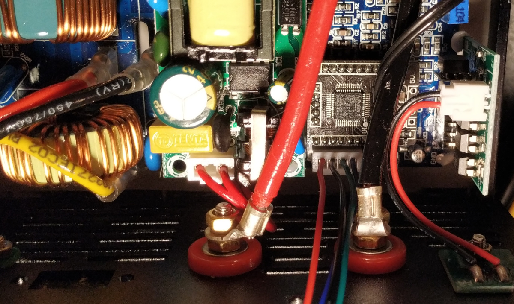
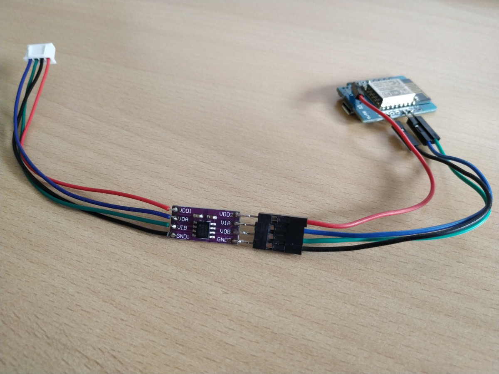
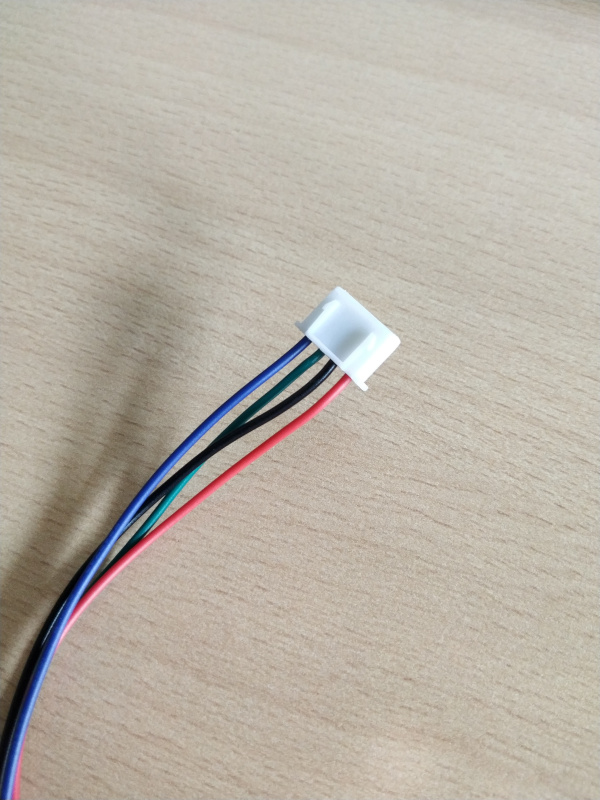
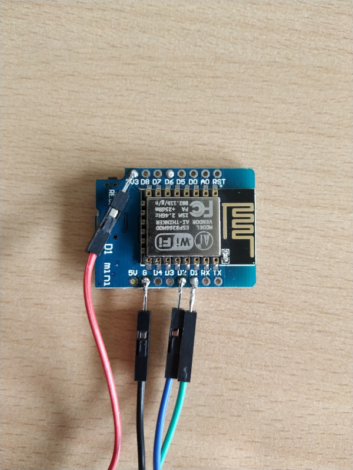

# Soyosource Display Version

## Internal Display Port

```

        │        │   R│ │
        │   CPU  │   S│ │
        └────────┘   4│ │
                     8│ │
            oooo     4│ │
            Disp        │
 ────────┐  ┌───┐  ┌────┘
         └──┘   └──┘ ││
          B+     B-

            ││││
            ││││
            ││││
            │││└── RXD
            ││└─── TXD
            │└──── GND
            └───── 5V
```



## Schematics

The display port connector is called SH 1.0mm, 4 Pin. Please remove the original display port cable. The pinout of the second connector is reversed. The digital isolator module is a ADUM1201.



| SH 1.0mm, 4 Pin connector                                                        | Wemos D1 mini                                          |
|:--------------------------------------------------------------------------------:|:------------------------------------------------------:|
|    |  |
