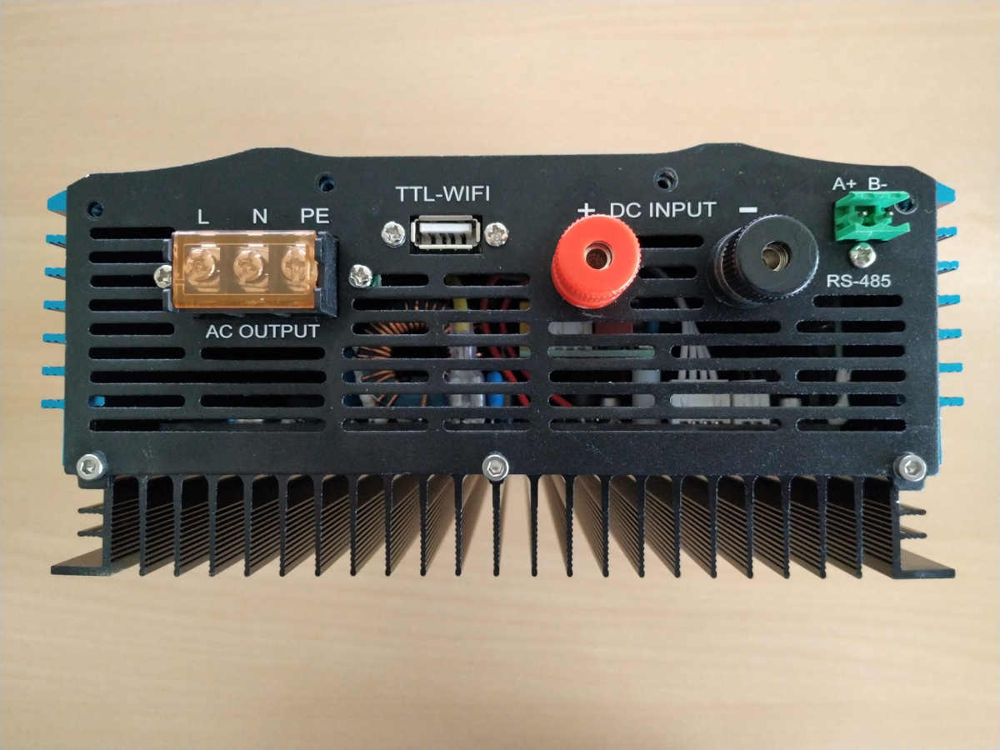
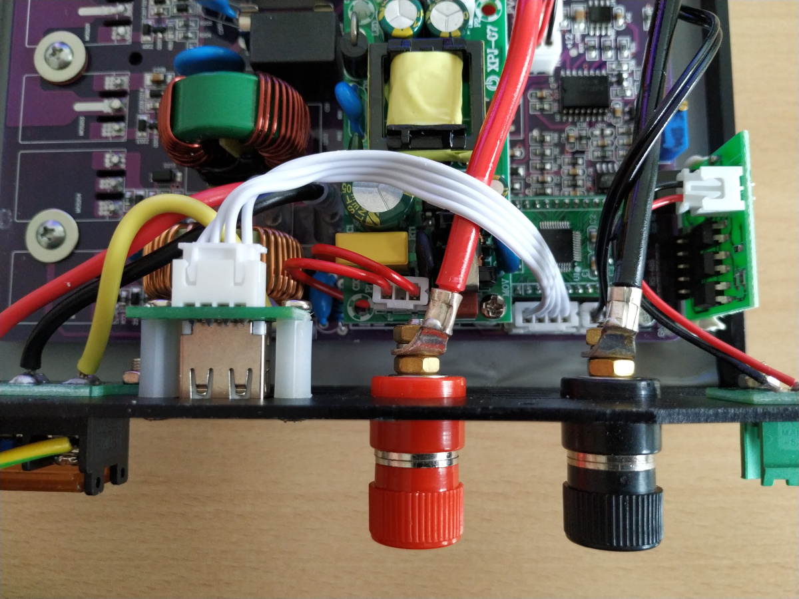
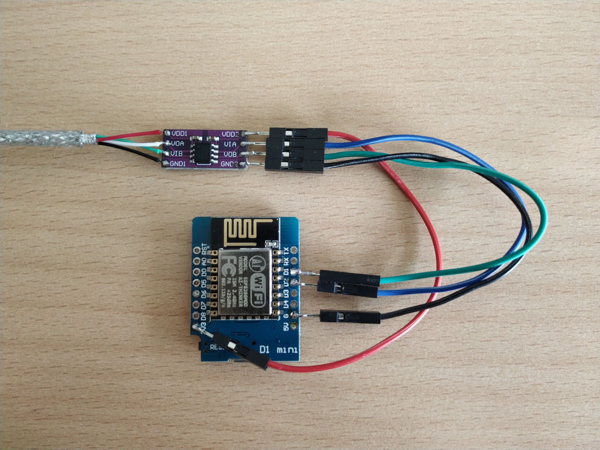
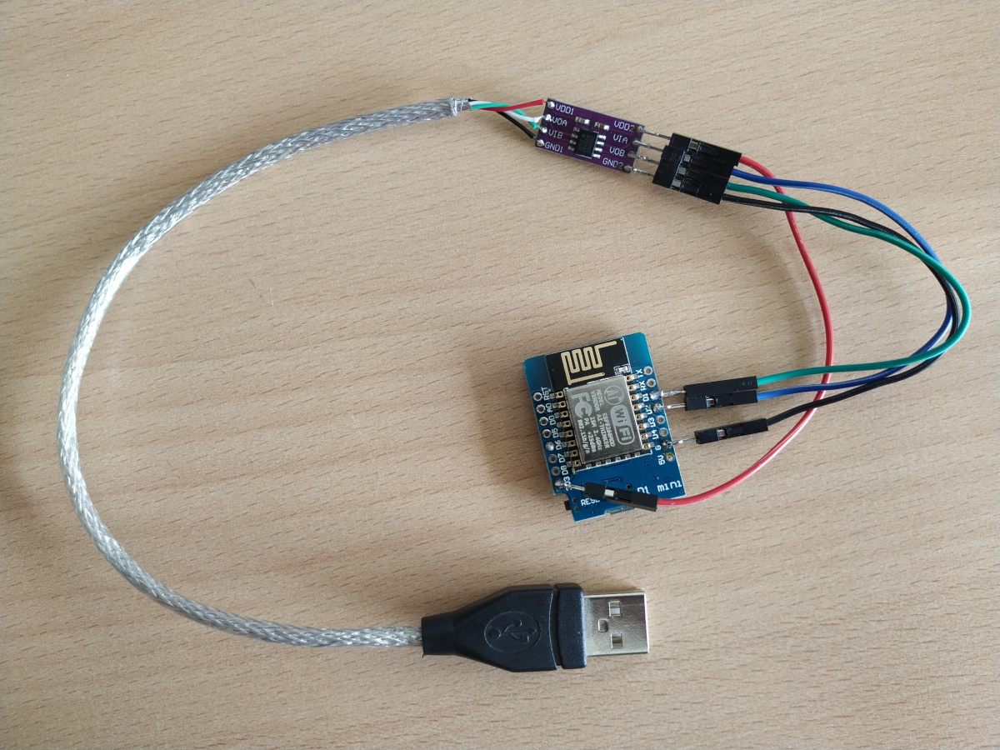

# Soyosource WiFi Version

## Display Port (`TTL-WIFI`)

```

 │                                           │
 │                                           │
 │               TTL-WIFI                    │
 └──┐        ┌────[oooo]───┐  ┌───┐  ┌──[oo]─┘
    └────────┘     ││││    └──┘   └──┘  RS485
     L  N  PE      ││││     B+     B-
                   ││││
                   ││││                   ESP32/ESP8266
                   ││││
                   │││└── GND (black) ─── GND
                   ││└─── TXD (green) ─── GPIO5 `rx_pin`
                   │└──── RXD (white) ─── GPIO4 `tx_pin`
                   └───── 5V  (red)  ──── VCC (if you power the ESP using the display port)
```





## Schematics

The display port connector is an ordinary USB plug. There is no USB host attached to the USB port. The connector was abused to expose `RXD`, `TXD`, `GND` and `VCC` of the internal display port.




